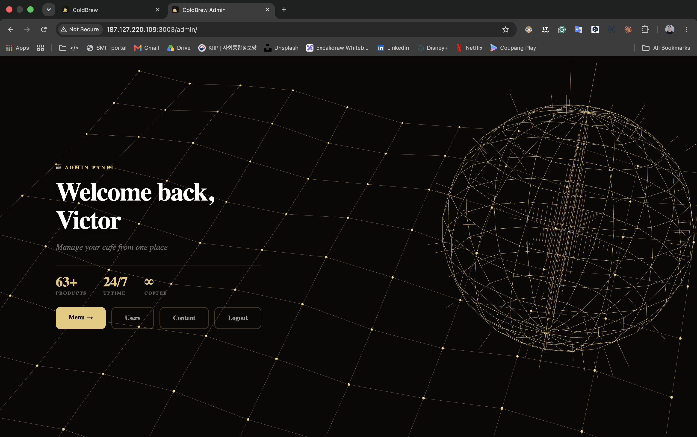
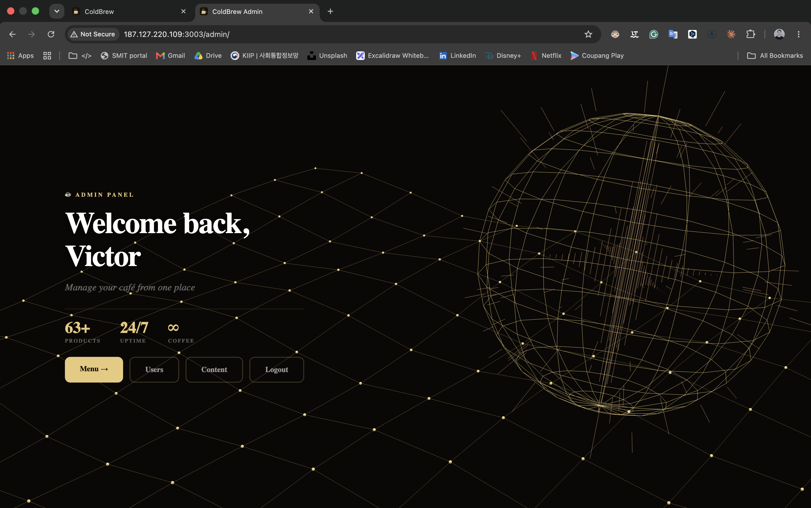
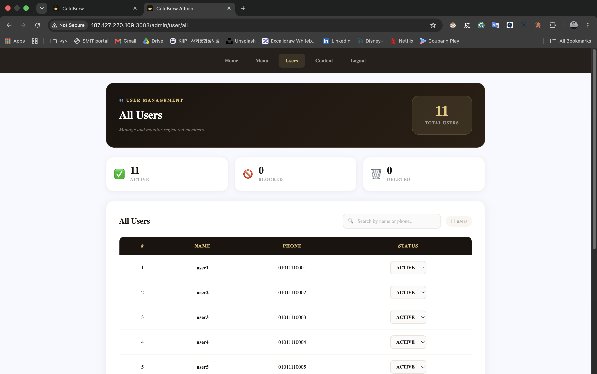

<div align="center">

# ColdBrew — Backend & Admin Panel

**REST API and server-rendered admin panel for the ColdBrew coffee-shop e-commerce app.**

### [▶ Live demo](http://187.127.220.109:3000) · [Frontend repository (screenshots & features)](https://github.com/khodiboev/coldbrew-react)


</div>

## Overview

This repository contains the server side of ColdBrew:

- a **REST API** used by the React storefront ([coldbrew-react](https://github.com/khodiboev/coldbrew-react)) — members, products, orders and help-page content;
- an **admin panel** rendered on the server with EJS, where the shop owner manages products, customers, Terms and FAQ.

For the product overview, screenshots of the storefront and the full feature list, see the [frontend repository](https://github.com/khodiboev/coldbrew-react).

## Admin panel



| Products | Customers |
|---|---|
|  |  |

- Create products with up to **5 images**, edit price, stock, size, volume and status
- Change a customer's status (active, blocked, deleted)
- Edit the Terms & Conditions and FAQ shown on the storefront's Help page

## Architecture

The code follows an **MVC** structure:

```
src/
├── server.ts            env validation, MongoDB connection, graceful shutdown
├── app.ts               middleware: helmet, CORS, rate limit, sessions, EJS, routers, Socket.IO
├── router.ts            REST API for the React SPA
├── router-admin.ts      /admin routes (server-rendered EJS)
├── controllers/         request handling: member, product, order, content, restaurant (admin)
├── models/              business logic services: Member, Product, Order, View, Content, Auth
├── schema/              Mongoose schemas: Member, Product, Order, OrderItem, View, Term, Faq
├── views/ + public/     EJS templates, CSS and browser JS for the admin panel
└── libs/                enums, types, errors, config, image uploader
```

A request flows **router → controller → service (models/) → Mongoose schema → MongoDB**. Controllers only handle HTTP; business rules such as delivery fees or loyalty points live in the services.

## API

| Method | Endpoint | Auth | Description |
|---|---|:---:|---|
| POST | `/member/signup` | | Create a customer account |
| POST | `/member/login` | | Log in; sets a JWT in an `httpOnly` cookie |
| POST | `/member/logout` | ✔ | Log out |
| GET | `/member/detail` | ✔ | Current member's profile |
| POST | `/member/update` | ✔ | Update profile and avatar (multipart) |
| GET | `/member/top-users` | | Top 4 customers by loyalty points |
| GET | `/member/restaurant` | | Shop (admin) profile |
| GET | `/product/all` | | Products with search, category filter, sorting and pagination |
| GET | `/product/:id` | optional | Product detail; counts a view once per signed-in member |
| POST | `/order/create` | ✔ | Create an order from basket items |
| GET | `/order/all` | ✔ | Member's orders by status, with items and product data |
| POST | `/order/update` | ✔ | Change order status (pay, cancel, finish) |
| GET | `/content/terms` | | Terms & Conditions |
| GET | `/content/faqs` | | FAQ |
| GET | `/health` | | Health check |

Admin routes live under `/admin` (login, products, users, content) and are protected by the owner's session.

## Business rules

- **Order total:** sum of item price × quantity, plus a **$5 delivery fee** for orders under $100.
- **Order lifecycle:** `PAUSE` (placed) → `PROCESS` (paid) → `FINISH` (received), or `DELETE` (cancelled).
- **Loyalty points:** moving an order to `PROCESS` adds 1 point to the customer; the top 4 customers are shown on the home page.
- **Views:** a product's view count grows once per signed-in member, tracked in a separate `View` collection.
- **Orders with items:** `GET /order/all` uses a MongoDB aggregation (`$lookup`) to return orders together with their items and product details in one query.

## Security

- **Two authentication methods:** JWT in an `httpOnly` cookie for customers, server-side sessions stored in MongoDB (`connect-mongodb-session`) for the admin
- Passwords hashed with **bcrypt**
- **helmet** security headers and a **CORS allow-list** in production
- **Rate limiting** on login and signup (20 attempts per 15 minutes)
- **Environment validation** at startup: the server refuses to start without `MONGO_URL`, `SESSION_SECRET` and `SECRET_TOKEN`, and warns about short secrets
- Graceful shutdown on `SIGINT` / `SIGTERM`

## Tech stack

Node.js, Express, TypeScript, MongoDB / Mongoose, EJS, JWT, express-session, bcrypt, multer (image uploads), helmet, express-rate-limit, Socket.IO, PM2.

## Run locally

Requirements: Node.js 18+ and a MongoDB database (local or Atlas).

```bash
git clone https://github.com/khodiboev/coldbrew.git
cd coldbrew
npm install
```

Create `.env`:

```
MONGO_URL=mongodb://localhost:27017/coldbrew
SESSION_SECRET=<random string, 32+ characters>
SECRET_TOKEN=<random string, 32+ characters>
PORT=3003
```

```bash
npm run seed:content   # optional: sample Terms & FAQ
npm run start:dev      # API on http://localhost:3003, admin on http://localhost:3003/admin
```

Production:

```bash
npm run build
pm2 start process.config.js --env production
```

## Author

**Jurabek (Juno) Khodiboev** — full-stack developer in Seoul
[LinkedIn](https://www.linkedin.com/in/jurabek-khodiboev-4bab4427b) · [GitHub](https://github.com/khodiboev) · [Ask my AI assistant](https://ask.santacar.tech)
